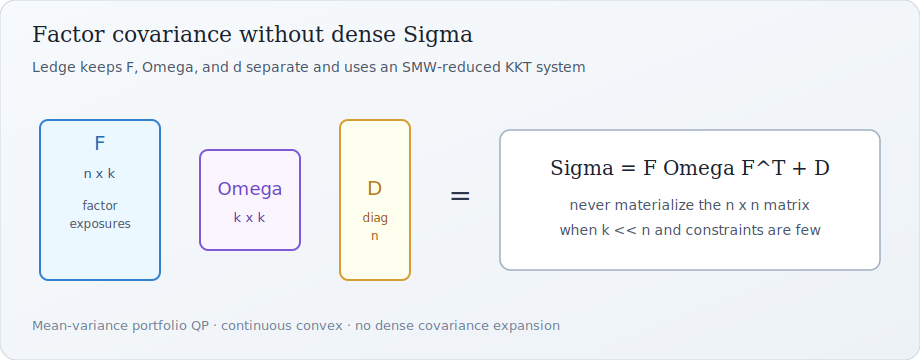
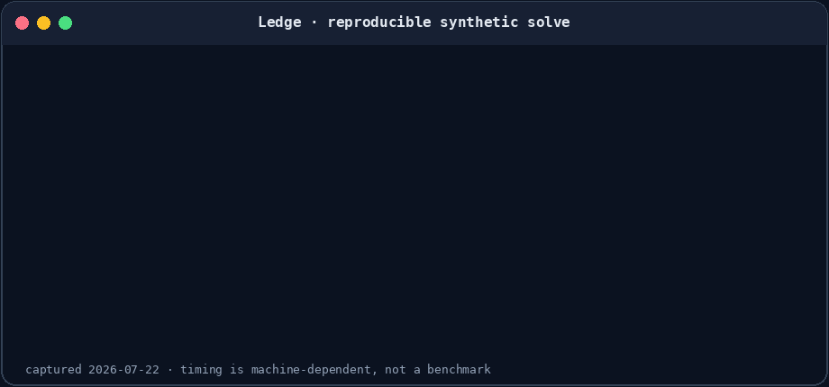
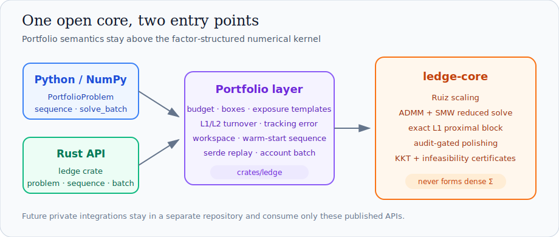
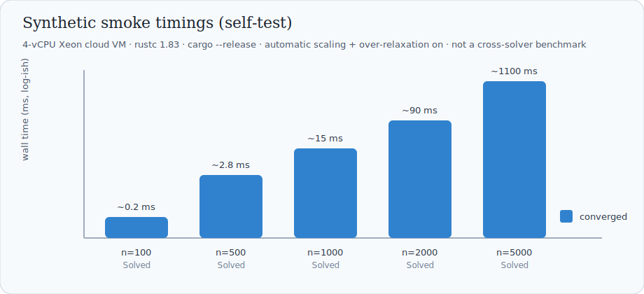
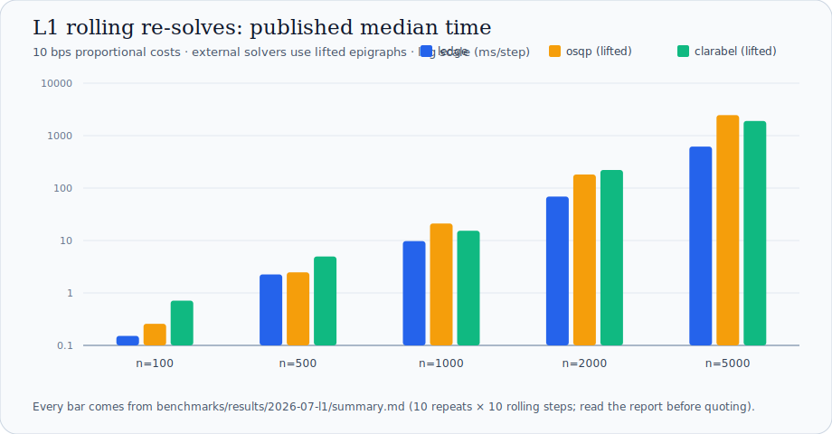

# Ledge

[](https://github.com/Jiangki/ledge/actions/workflows/ci.yml)
[](https://pypi.org/project/ledge-portfolio/)
[](https://crates.io/crates/ledge-portfolio)
[](https://jiangki.github.io/ledge/)
[](LICENSE)
[](CHANGELOG.md)

Factor-structured mean-variance portfolio optimization for Rust and Python.

Ledge solves continuous convex portfolio QPs **without expanding** the factor
covariance

$$
\Sigma = F\Omega F^{\mathsf{T}} + \mathrm{diag}(d)
$$

into a dense asset-by-asset matrix. The practical target is repeated,
small-to-medium portfolio rebalancing with budget, box constraints, and a
modest number of linear constraints.

<p align="center">
  
</p>

**Status:** alpha (`0.2.0`). The release is available from
[PyPI](https://pypi.org/project/ledge-portfolio/), [crates.io
(`ledge-portfolio`)](https://crates.io/crates/ledge-portfolio), and
[crates.io (`ledge-core`)](https://crates.io/crates/ledge-core).
The Python import and Rust library name are both `ledge`.

> [!WARNING]
> APIs and defaults may change before 1.0. Ledge exposes auditable residuals,
> but it is not a production risk system or a substitute for independent
> validation.

**[Documentation](https://jiangki.github.io/ledge/)** ·
**[Python quick start](#five-minute-python-example)** ·
**[Rust API](#rust-api)** ·
**[Benchmarks](#performance-smoke)** ·
**[Limitations](#limitations)** ·
**[Contributing](CONTRIBUTING.md)**

<p align="center">
  
</p>

The animation is generated from a real seeded release-build command. Its wall
time is machine-dependent and is not a benchmark; capture data and the
reproduction script live in [`docs/assets/`](docs/assets/README.md).

## Who is this for?

- **Python quantitative researchers and engineers** whose covariance already
  comes as `F`, `omega`, and `d`, and who want a direct NumPy API plus warm
  starts for rolling rebalances.
- **Rust backtest and service authors** who need an in-process solver with no
  commercial runtime dependency.
- **Researchers and practitioners** who want reproducible factor-QP examples and
  independently inspectable KKT residuals.

## Why Ledge?

| Need | What Ledge provides |
|---|---|
| Preserve factor structure | Accepts `F`, `omega`, and `d` directly; never materializes dense covariance |
| Rebalance repeatedly | Cached equilibration/factorizations plus automatic primal-dual warm starts |
| Model trading costs | Smooth L2 turnover and exact L1 proportional costs with a no-trade region |
| Audit solver output | Original-space KKT residuals, diagnostics, polishing, and infeasibility certificates |
| Embed without a service | Pure-Rust core, a public Rust API, and NumPy bindings that release the GIL |

## Quick start

Requirements: Rust 1.83+; Python 3.9+ for the bindings.

Python:

```bash
python -m pip install ledge-portfolio==0.2.0
```

Rust:

```toml
[dependencies]
ledge = { package = "ledge-portfolio", version = "0.2" }
```

Run the repository examples or build the Python package from source:

```bash
git clone https://github.com/Jiangki/ledge.git
cd ledge
cargo test --workspace
cargo run -p ledge-portfolio --release --example rebalance

python3 -m venv .venv
source .venv/bin/activate
python -m pip install --upgrade pip maturin
python -m pip install -e python/
python python/examples/rebalance.py
```

Platform wheels are published for Linux x86-64/aarch64, macOS universal2,
and Windows x86-64. Other platforms build from the source distribution.

## Five-minute Python example

```python
import numpy as np
from ledge import PortfolioProblem

rng = np.random.default_rng(7)
n, k = 100, 8
F = rng.normal(0.0, 0.2, size=(n, k))
omega = np.diag(rng.uniform(0.04, 0.12, size=k))
d = rng.uniform(0.05, 0.10, size=n)
mu = rng.normal(0.08, 0.02, size=n)

problem = PortfolioProblem(
    F,
    omega,
    d,
    mu,
    risk_aversion=8.0,
    budget=1.0,
    lower_bounds=np.zeros(n),
    upper_bounds=np.full(n, 0.03),
)
first = problem.solve()
print(first.status, first.primal_residual, first.weights.sum())

# Next date: turnover control around the previous weights + warm start.
# `turnover_penalty` is a smooth L2 preference; `l1_turnover_costs` is
# exact proportional transaction cost (scalar or per-asset array) with a
# genuine no-trade region. They can be combined.
next_problem = PortfolioProblem(
    F,
    omega,
    d,
    mu + rng.normal(0.0, 0.005, size=n),
    risk_aversion=8.0,
    lower_bounds=np.zeros(n),
    upper_bounds=np.full(n, 0.03),
    previous_weights=first.weights,
    l1_turnover_costs=0.001,  # 10 bps per unit traded
)
second = next_problem.solve(warm_start=first.weights)
print(second)
```

Arrays must be NumPy `float64`. Optional `equality_*` / `inequality_*`
arguments add linear constraints (`A @ w <= b` for inequalities).
`solve_mean_variance_factor(...)` is the one-shot function form.

For rolling multi-date workloads, `problem.sequence()` returns a
`PortfolioSequence` that keeps the equilibration and reduced factorizations
cached and chains warm starts automatically; each date is one
`sequence.solve_next(expected_returns=..., previous_weights=...)` call. See
[`python/examples/rolling.py`](python/examples/rolling.py) for the minimal
loop and
[`docs/examples/rolling_backtest.py`](docs/examples/rolling_backtest.py)
for a full momentum backtest with measured warm-start numbers. For many
accounts sharing one model, `ledge.solve_batch(problems, steps)` runs one
sequence per account in parallel over the account axis and returns one
result list per account.

<p align="center">
  
</p>

Coming from cvxpy? [`docs/cvxpy_migration.md`](docs/cvxpy_migration.md)
maps the common portfolio patterns (constraints, turnover costs, tracking
error, `cp.Parameter` loops, statuses) onto this API; every mapping in it
is executed against cvxpy + Clarabel in CI.

## Rust API

```rust
use ledge::{FactorCovariance, Matrix, PortfolioProblem, SolveStatus};

fn main() -> Result<(), Box<dyn std::error::Error>> {
    let factors = Matrix::new(3, 1, vec![1.0, -0.5, 0.25])?;
    let problem = PortfolioProblem::new(
        factors,
        FactorCovariance::Diagonal(vec![0.1]),
        vec![0.2, 0.3, 0.25],
        vec![0.08, 0.04, 0.06],
    )?
    .with_risk_aversion(5.0)?
    .with_bounds(vec![0.0; 3], vec![0.6; 3])?;

    let solution = problem.solve(None)?;
    assert_eq!(solution.status, SolveStatus::Solved);
    println!("{:?}", solution.x);
    Ok(())
}
```

Use `solution.warm_start()` for a full primal/dual warm start. The lower-level
`QpProblem` API remains available for custom continuous convex QPs. API docs:
[`ledge`](https://docs.rs/ledge-portfolio) and
[`ledge-core`](https://docs.rs/ledge-core).

## Architecture

<p align="center">
  
</p>

## What is implemented

- Native factor covariance (`F`, diagonal or dense PSD `omega`, `d`); no dense
  $\Sigma$ is formed.
- Mean-variance objective, budget, bounds, equalities, upper-form inequalities.
- Smooth L2 turnover around previous weights, and exact L1 proportional
  transaction costs (`with_l1_turnover` / `l1_turnover_costs`) via a
  dedicated soft-threshold prox block — machine-exact no-trade region, no
  growth of the reduced factorization; the two can be combined.
- Tracking-error objectives (`with_tracking_benchmark` /
  `benchmark_weights`): active risk against a benchmark as a pure
  linear-cost shift — same QP underneath.
- Constraint template builders (`with_industry_neutrality` /
  `with_group_targets` / `with_style_bounds` /
  `with_concentration_limit` / `with_short_limit`; Python
  `industry_ids=`, `style_matrix=`, `max_weight=`, `max_short=`, ...):
  industry neutrality, sleeve targets, style bands, and per-name caps
  compiled onto the existing constraint rows and boxes, with eager
  validation.
- Problem / solution serialization for bug reproduction (non-default
  `serde` feature; Python `PortfolioProblem.to_json()` / `from_json()`
  and `SolveResult.to_json()`): lossless, validated, bit-exact replayable
  dumps of problems, settings, warm starts, and full solver output.
- Primal / primal-dual warm starts.
- Reusable solve workspace (`Solver::workspace`): equilibration and the
  reduced factorization are built once and reused across rolling solves;
  expected returns / budget updates are applied in place.
- Rolling sequence API (`PortfolioProblem::sequence` /
  `solve_sequence`; Python `PortfolioProblem.sequence()` →
  `PortfolioSequence.solve_next(...)`): per-date data updates plus
  automatic warm-start chaining on top of the workspace cache.
- Multi-thread batch over the account axis (`solve_batch` /
  `BatchAccount`, non-default `rayon` feature; Python
  `ledge.solve_batch(problems, steps)`): one rolling sequence per account,
  optional backtest anchor chaining, per-account error isolation, and
  results identical to the serial loop regardless of thread count;
  published 1 model × 500 accounts × 250 dates throughput in
  [`benchmarks/results/2026-07-batch/`](benchmarks/results/2026-07-batch/README.md).
- Residual-balancing adaptive ADMM penalty and over-relaxation
  (default `over_relaxation=1.6`; `1.0` recovers plain ADMM).
- Automatic Ruiz equilibration with cost scaling (default on); residuals and
  termination are always evaluated on the original, unscaled data.
- SMW x-update; reduced factorization size is
  `factors + explicit linear constraints`.
- Status, objective, iteration/time diagnostics, and independent KKT checks.
- Solution polishing (default on): after convergence, one direct
  active-set solve refines residuals from ~1e-5 to ~1e-11 or better;
  adopted only when the independently audited KKT residuals improve.
- Infeasibility certificates: contradictory constraints stop early with a
  normalized, independently auditable Farkas certificate (unbounded
  objectives with a descent ray) and hints naming the conflicting
  portfolio constraints.
- Installable PyO3 package (releases the GIL while solving).
- Deterministic Rust / Python examples.

## Documentation

| Topic | Resource |
|---|---|
| Guided tutorials and API overview | [mdBook documentation](https://jiangki.github.io/ledge/) |
| Python installation and first solve | [Python quick start](https://jiangki.github.io/ledge/tutorial/quickstart-python.html) |
| Rust installation and first solve | [Rust quick start](https://jiangki.github.io/ledge/tutorial/quickstart-rust.html) |
| Rolling rebalances and batch solves | [Rolling tutorial](https://jiangki.github.io/ledge/tutorial/rolling.html) · [Batch tutorial](https://jiangki.github.io/ledge/tutorial/batch.html) |
| Constraints, turnover, diagnostics, tuning | [Guides](https://jiangki.github.io/ledge/guide/constraints.html) · [Tuning reference](https://jiangki.github.io/ledge/reference/tuning.html) |
| Migration from cvxpy | [`docs/cvxpy_migration.md`](docs/cvxpy_migration.md) |
| Mathematics and design | [`docs/algorithm.md`](docs/algorithm.md) · [`docs/factor_structure_note.md`](docs/factor_structure_note.md) |
| Reproducible performance evidence | [`benchmarks/README.md`](benchmarks/README.md) · [`docs/SMOKE_TIMINGS.md`](docs/SMOKE_TIMINGS.md) |

## Performance smoke

We publish **self-timing smoke numbers**, not competitive rankings. Full method
and caveats: [`docs/SMOKE_TIMINGS.md`](docs/SMOKE_TIMINGS.md).

<p align="center">
  
</p>

Reproduce:

```bash
cargo run -p ledge-portfolio --release --example synthetic -- --n 500 --k 10 --seed 42
```

Recent smoke on a 4-vCPU Xeon cloud VM (`rustc 1.83`, `--release`, default
settings including over-relaxation):

| instance | status | iterations | time (ms) |
|---|---|---:|---:|
| n=100, k=5 | Solved | 30 | ~0.2 |
| n=500, k=10 | Solved | 90 | ~2.8 |
| n=1000, k=20 | Solved | 170 | ~15 |
| n=2000, k=50 | Solved | 260 | ~90 |
| n=5000, k=100 | Solved | 660 | ~1100 |

**Practical range today:** the declared envelope ($n \le 5000$, $k \le 100$,
few explicit constraints) passes the synthetic smoke matrix under default
settings since automatic scaling landed. These are single-seed synthetic
instances, not a guarantee for every real problem of this size.

Protocol-compliant OSQP/Clarabel comparisons are published under
`benchmarks/results/` (adapters behind non-default features; see
[`benchmarks/README.md`](benchmarks/README.md)): the
[first report](benchmarks/results/2026-07/README.md), a
[re-run after over-relaxation became the default](benchmarks/results/2026-07-over-relaxation/README.md),
a
[re-run after workspace factorization reuse](benchmarks/results/2026-07-workspace/README.md),
and a
[re-run with polish-on defaults and L1 turnover instances](benchmarks/results/2026-07-l1/README.md).
The honest headline: naive dense-`Q` usage of general solvers is 1–2 orders
of magnitude slower than factor-aware solving; Ledge beats OSQP at every
size and, **on instances with proportional (L1) transaction costs — the
realistic rebalancing case — is the fastest solver at every size, cold and
rolling** (the epigraph reformulation external solvers need costs them
2–6x; Ledge's prox block costs ~8%). On smooth instances a hand-lifted
Clarabel formulation remains the fastest cold baseline at `n >= 2000`
(2.3x at `n = 5000` under polish-on defaults). Default residuals are now
audited at ~1e-11 or better. Read the reports' findings before quoting any
single number. The short technical note
[`docs/factor_structure_note.md`](docs/factor_structure_note.md) walks
through what the gap measures and where it does not apply.

<p align="center">
  
</p>

The chart is generated directly from the committed L1 report, not transcribed
by hand. Reproduce it with `python scripts/generate_demo_assets.py`; read the
full report before quoting a bar.

## L1 turnover

Exact proportional transaction costs $c^\mathsf{T}|w-w_0|$ are supported
natively (`with_l1_turnover` in Rust, `l1_turnover_costs=` in Python — a
scalar broadcasts to all assets). The term is handled by a dedicated
soft-threshold proximal block inside ADMM, so the reduced factorization
keeps its `factors + constraints` dimension — unlike an epigraph
reformulation, which adds $2n$ constraints and loses the factor-structure
advantage. The no-trade region is machine-exact, the L1 multipliers are
audited like every other dual, and rolling sequences move the anchor
without refactorizing. Validated against epigraph reformulations and
cvxpy + Clarabel.

## Limitations

- Alpha: APIs/defaults may change before 1.0.
- Continuous convex QPs only — no integers, SOCP, or general NLP.
- Problems infeasible by a margin below `infeasibility_tolerance` (default
  `1e-5`) stop at `MaxIterations` with hints rather than a certificate.
- Dense storage of $F$, dense $\Omega$, and explicit constraint blocks;
  unsuitable when explicit constraints are $O(n)$.
- Workspace reuse requires a fixed structure (covariance, constraint
  matrices, bounds); adaptive penalty changes still rebuild the reduced
  factorization in full.
- Release automation builds abi3 wheels for Linux x86-64/aarch64, macOS
  universal2, and Windows x86-64; other platforms build from source.
- Degenerate active sets (every weight pinned on a bound) can reject the
  polishing step; those solves return ADMM-tolerance (~1e-5) residuals
  instead of polished (~1e-11) ones. `SolveResult.polished` reports which.

## Project status and roadmap

Release `0.2.0` ships the Rust crates, Python wheels, documentation site,
factor-aware benchmarks, scaling, exact L1 costs, polishing, certificates,
rolling sequences, and account batching.

The next priorities are evidence and stability rather than a broader solver
scope:

1. collect redacted real workloads and turn failures into regression tests;
2. evaluate sparse factor storage only when those workloads justify it;
3. complete the API, MSRV, semver, and deprecation review before 1.0.

Detailed milestones: [`docs/PLAN.md`](docs/PLAN.md) and
[`docs/ROADMAP.md`](docs/ROADMAP.md).

## Non-goals

- Mixed-integer programming (MIP / MIQP) or a general modeling language.
- Feature parity with commercial solvers (Gurobi, CPLEX, MOSEK) or CVXPY.
- GPU / distributed execution.
- Unverified “faster than X” marketing claims.
- Becoming a general-purpose commercial QP company.

## Security

Ledge is not hardened for untrusted inputs in a multi-tenant service. Please
do not file public issues for sensitive reports; follow
[`SECURITY.md`](SECURITY.md). The latest repository audit is recorded in
[`docs/SECURITY_AUDIT.md`](docs/SECURITY_AUDIT.md).

## Repository layout

```text
crates/ledge-core/     numerical kernel, portfolio API, KKT checks, generators
crates/ledge/          `ledge-portfolio` Rust package (`ledge` library) + examples
python/                PyO3/maturin package + examples/tests
docs/                  plan, roadmap, algorithm notes, smoke timings, assets
docs/book/             mdBook docs site source (built in CI; `mdbook build docs/book`)
docs/examples/         rolling backtest example + published warm-start numbers
docs/assets/           reproducible README diagrams, chart, terminal GIF + provenance
benchmarks/            comparison protocol, adapters (non-default features), results
.github/workflows/     CI + manual release/docs deployment
.github/ISSUE_TEMPLATE/  bug / performance / problem-instance templates
```

Project governance and release controls:
[`docs/DECISIONS.md`](docs/DECISIONS.md),
[`docs/OPEN_CORE.md`](docs/OPEN_CORE.md), and
[`docs/PUBLIC_RELEASE_CHECKLIST.md`](docs/PUBLIC_RELEASE_CHECKLIST.md).

## License

Licensed under Apache-2.0. See [`LICENSE`](LICENSE) and [`NOTICE`](NOTICE).
Development notes: [`CONTRIBUTING.md`](CONTRIBUTING.md).
