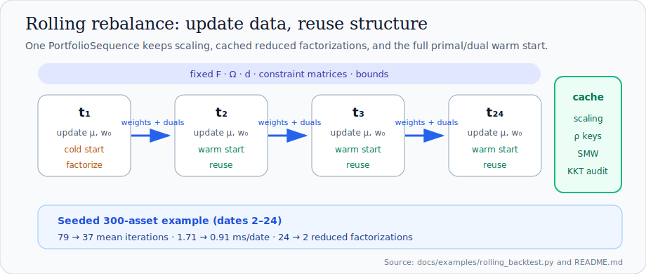

# Rolling rebalances

Rolling workloads — daily or weekly rebalances where mostly the expected
returns and the previous holdings change — are the workload Ledge is built
around. A `PortfolioSequence` keeps the Ruiz equilibration and the reduced
factorizations cached across dates and chains full primal/dual warm starts
automatically.



## Python

```python
sequence = problem.sequence()          # solver kwargs accepted here
for date in dates:
    result = sequence.solve_next(
        expected_returns=mu[date],
        previous_weights=held,         # turnover anchor for L2 and L1
    )
    held = result.weights
```

`solve_next` accepts only *factorization-preserving* updates:

| Keyword | Rolls |
|---|---|
| `expected_returns` | the linear cost |
| `previous_weights` | the L2/L1 turnover anchor |
| `benchmark_weights` | the tracking benchmark (base problem must have one) |
| `budget` | the budget row RHS |
| `equality_rhs`, `inequality_rhs` | constraint right-hand sides (including template targets) |

Structural changes — covariance, constraint matrices, bounds, turnover
penalty — are rejected with an explanatory error: build a new problem and a
new sequence. This makes the cost model visible in the API: everything a
step can express reuses the cached factorization.

Steps are atomic. A rejected date (bad feed, impossible budget) leaves the
sequence exactly as it was, so production loops can skip it and keep
rolling. An unconverged date (`MaxIterations`) does not abort the sequence;
an infeasible date restarts the next date cold so diverged duals never
poison the warm start.

## Rust

```rust,ignore
let mut sequence = problem.sequence()?; // or sequence_with(&solver)
for step in steps {
    let solution = sequence.solve_next(&step)?; // step: RebalanceStep
}
// One-call form over a precomputed step list:
let solutions = ledge::solve_sequence(&problem, &settings, &steps)?;
```

## Measured effect

From the repository's seeded momentum backtest (300 assets, 12 factors, 24
monthly dates, 10 bps L1 costs, tracking benchmark; see
`docs/examples/README.md` in the repository): warm dates converge in 37
iterations vs 79 cold (2.1x), 0.91 ms vs 1.71 ms (1.9x), and factorizations
drop from 24 to 2 across the backtest. Rolling steps reach a steady state of
**zero refactorizations** because revisited penalties hit the workspace
cache.
